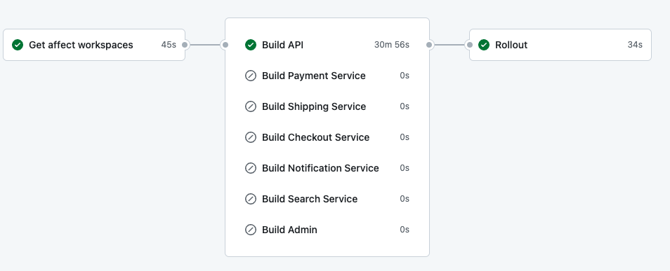
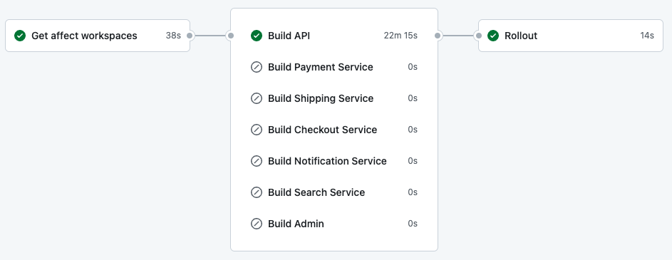
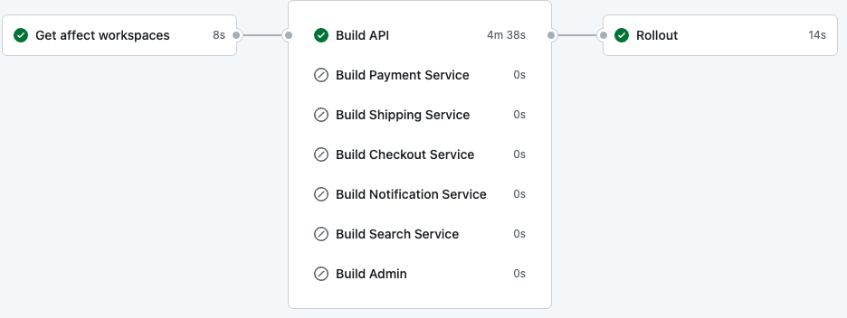

# How we cut 10% of our AWS bill by using ARM-based instances in Cohart
### 14-09-2023
- The talk will be highly relevant to NodeJS developers. But hopefully you could still learn something from it even if you're not

*This presentation is purely made by Markdown btw. Pretty cool I know!*
---
# Introduction: What is Graviton

### It is a CPU that is:

- [Designed by AWS](https://aws.amazon.com/ec2/graviton/)
- ARM64-based (vs x86 from Intel/AMD)
- [Seemingly having a better performance](https://www.phoronix.com/review/graviton3-amd-intel)
- [Cheaper by 10% comparing to x86-based instances on AWS](https://instances.vantage.sh/?filter=m6g.large|m5.large&compare_on=true&selected=m6g.large,m5.large)
- Availble not just for EC2 but also ECS, RDS, etc

It's much more common than you think.

*If you're using the M1 Macbook, then you're using ARM-based CPU!*
---
# How to utilize it

- For managed service (e.g RDS, OpenSearch, etc): choosing the Graviton CPU would work just fine!
- For running your own software: you need to compile it for ARM64
  - Not all softwares have support for ARM64 (The initial M1 launch)
  - You have to compile your software to be able to run on ARM64
```bash
$ GOARCH=arm64 go build myapp
```
---
# The case of Cohart
- Our backend services are written in NodeJS + TypeScript
- We utilize containers to run our services
- We use Kubernetes (AWS EKS) to manage our containers

# The convenience
- JS is an interpreted language. We can just use the official NodeJS Docker image for ARM64, meaning in your Dockerfile:
```dockerfile
# When you declare the source image like this, Docker will automatically pull the correct image for you
FROM node:lts
```
- Seems easy and straightforward right? But there's a catch! However before we get to that...
---
# How to build ARM64 Docker image

## Multi-arch Docker image
- Each Docker image is represented by a manifest. A manifest is a JSON file containing all the information about a Docker image

```bash
$ docker manifest inspect ‐‐verbose rust:1.42-slim-buster
```

```json
[
  {
    "Ref": "docker.io/library/rust:1.42-slim-buster@sha256:1bf29985958d1436197c3b507e697fbf1ae99489ea69e59972a30654cdce70cb",
    "Descriptor": {
      "mediaType": "application/vnd.docker.distribution.manifest.v2+json",
      "digest": "sha256:1bf29985958d1436197c3b507e697fbf1ae99489ea69e59972a30654cdce70cb",
      "size": 742,
      "platform": {
        "architecture": "amd64",
        "os": "linux"
      }
    },
    "SchemaV2Manifest": { ... }
  },
  {
    "Ref": "docker.io/library/rust:1.42-slim-buster@sha256:116d243c6346c44f3d458e650e8cc4e0b66ae0bcd37897e77f06054a5691c570",
    "Descriptor": {
      "mediaType": "application/vnd.docker.distribution.manifest.v2+json",
      "digest": "sha256:116d243c6346c44f3d458e650e8cc4e0b66ae0bcd37897e77f06054a5691c570",
      "size": 742,
      "platform": {
        "architecture": "arm",
        "os": "linux",
        "variant": "v7"
      }
    },
    "SchemaV2Manifest": { ... }
...
]
```
- To acheive this, you can either:
  - Use `docker manifest` command
  - Use `docker buildx` utilities (the recommended way)
---
# Using Docker buildx

### On your machine, `buildx` is shipped with Docker Desktop

```bash
$ docker buildx build \
--platform linux/arm/v7,linux/arm64/v8,linux/amd64 . 
```

### On GitHub Actions
```yaml
# Setup Docker Buildx
- name: Set up Docker Buildx
  uses: docker/setup-buildx-action@v2

# Then you could use it to perform the stuff
- name: Build
  uses: docker/build-push-action@v4
  with:
    context: .
    platforms: linux/amd64,linux/arm64

```
### The result
```bash
$ docker buildx imagetools inspect 583334217631.dkr.ecr.us-east-1.amazonaws.com/cohart-prod-api:latest
```
```
Name:      583334217631.dkr.ecr.us-east-1.amazonaws.com/cohart-prod-api:latest
MediaType: application/vnd.oci.image.index.v1+json
Digest:    sha256:474f937ef7ecfc6a042de0e791c7ee1fc0dc6da9445f3d2f5d04bd61cdd3495d

Manifests:
  Name:        583334217631.dkr.ecr.us-east-1.amazonaws.com/cohart-prod-api:latest@sha256:d5927803d0ecc5ff8654daf4209c38bff758bdcd0f495dc0b2b2093bef099443
  MediaType:   application/vnd.oci.image.manifest.v1+json
  Platform:    linux/amd64

  Name:        583334217631.dkr.ecr.us-east-1.amazonaws.com/cohart-prod-api:latest@sha256:ba6895a8cdc56afa507ca047da4e623903be5e650b2f303c3d3489b7be8a63ab
  MediaType:   application/vnd.oci.image.manifest.v1+json
  Platform:    linux/arm64
```
---
# Migrate the workload with zero downtime #1

- We are currently using [eksctl](https://eksctl.io/) to manage our EKS cluster
- It helps us to create the cluster, manage the node groups, etc based on a YAML file
- If you are not using it, I highly recommend you to try it out!

## What we are going to do
1. Create a new node group with ARM-based instances
```diff
...
managedNodeGroups:
  # Old x86-based node group
  - name: old
    instanceTypes: ['m5.large']
    minSize: 2
    desiredCapacity: 2
    maxSize: 3

  # Add a new node group with ARM-based instances
+  - name: graviton
+    instanceTypes: ['m6g.large']
+    minSize: 2
+    desiredCapacity: 2
+    maxSize: 3
...
```
2. Move the workload from the old node group to the new one by specifying the `nodeSelector` in the Kubernetes deployment

```diff
+     nodeSelector:
+       eks.amazonaws.com/nodegroup: graviton
      containers:
        - name: api
          image: 583334217631.dkr.ecr.us-east-1.amazonaws.com/cohart-prod-api:latest
```
---
# Migrate the workload with zero downtime #2

3. Wait for the new node group to be ready, then remove the old node groups
```diff
...
managedNodeGroups:
- - name: old
-   instanceTypes: ['m5.large']
-   minSize: 2
-   desiredCapacity: 2
-   maxSize: 3
...
```
```bash
$ eksctl delete nodegroup --cluster=cohart-prod --name=old
```
4. Update the `nodeSelector` since we don't need it anymore
```diff
-     nodeSelector:
-       eks.amazonaws.com/nodegroup: graviton
      containers:
        - name: api
          image: 583334217631.dkr.ecr.us-east-1.amazonaws.com/cohart-prod-api:latest
```

## DO IT ON THE STAGING ENVIRONMENT FIRST! IF THE QA TEAM IS HAPPY, THEN DO IT ON PRODUCTION!
---
# The result

```bash
chafa --scale 1.0 ./images/result.png
```
- I couldn't get the exact number of the cost saving since we kept adding resources in middle of the month, but it's around 10% comparing to the x86-based instances


## WAIT! THERE IS A CATCH I MENTIONED BEFORE!
---
# GitHub Action Runners DON'T SUPPORT ARM64!

```yaml
- name: Set up Docker Buildx
  uses: docker/setup-buildx-action@v2

- name: Build
  uses: docker/build-push-action@v4 
  with:
    context: .
    platforms: linux/amd64,linux/arm64 # THIS WON'T WORK
```

### Luckily there is a workaround, using a QEMU-based emulator
```diff
+ - name: Set up QEMU
+   uses: docker/setup-qemu-action@v2
+   with:
+     platforms: arm64

- name: Set up Docker Buildx
  uses: docker/setup-buildx-action@v2

- name: Build
  uses: docker/build-push-action@v4 
  with:
    context: .
    platforms: linux/amd64,linux/arm64 # THIS NOW WORKS!
```
The build for x86-based instances will be done natively, while the build for ARM-based instances will be done using the emulator. All good right?
---
# Not so fast...


### The build time is now 30 minutes! What happened? Checking the logs:
```
#32 [linux/arm64 runner 7/9] RUN pnpm install --prod
...
#32 677.5 Done in 11m 13.9s
#32 DONE 677.8s
```
```
#34 358.7 @cohart-backend/api:build: 
#34 358.7 @cohart-backend/api:build: > @cohart-backend/api@1.0.0 build /app/apps/api
#34 358.7 @cohart-backend/api:build: > tsc
#34 358.7 @cohart-backend/api:build: 
#34 993.0 
#34 993.0  Tasks:    3 successful, 3 total
#34 993.0 Cached:    0 cached, 3 total
#34 993.0   Time:    16m28.539s 
#34 993.0 
#34 DONE 993.3s
```
## Installing dependencies takes over 10 minutes. And building TypeScript takes over 16 minutes
## Turns out the CPU/Disk/Network performance of the emulator is horrible
---
# Optimizing for the Docker build process
## `buildx` does support caching
```diff
- name: Build
  uses: docker/build-push-action@v4 
  with:
    context: .
    platforms: linux/amd64,linux/arm64
+   # Add this to make `buildx` automatically push the image to the registry
+   push: true 
+   # Add this to make `buildx` use the cache from the registry
+   cache-from: type=registry,ref=<repo>
+   cache-to: type=inline
```
## The result


### We went from 30 minutes to 22 minutes! Because:
- The installing dependencies step is now cached
- The building TypeScript step cannot be cached since our source code is different every time
  
### 25% performance increase is great. But 20+ minutes is still unacceptable
---
# `tsc` is really slow
- `tsc` performs horribly on the emulator because it's a CPU-intensive task

### Can we use something else?
- I briefly thought about installing dependencies and building TypeScript on the x86 machine, then copy the `node_modules` and `dist` folder to the Docker image. But it's not a good idea since it could really mess up the cache, and some dependencies are platform-specific (e.g `sharp`)
- `esbuild`: a JavaScript bundler that is written in Go. It also helps us to bundle our TypeScript code
- `swc`: a Javascript compiler and bundler that is written in Rust. It could take both JavaScript / TypeScript files

### Making the decision
- Both `esbuild` and `swc` ship with binaries for ARM64
- `esbuild` does NOT support `emitDecoratorMetadata` flag, which is required for our project. While `swc` does
- Being a bunlder `eslbuid` is, it could obfuscate our code, which is not ideal for debugging on prod
---
# Supporting `swc` in our project
### Adding `.swcrc`
```json
{
  "$schema": "https://json.schemastore.org/swcrc",
  "sourceMaps": true,
  "module": {
    "type": "commonjs"
  },
  "jsc": {
    "target": "esnext",
    "parser": {
      "syntax": "typescript",
      "decorators": true
    },
    "transform": {
      "legacyDecorator": true,
      "decoratorMetadata": true // This is the flag that esbuild doesn't support
    },
    "keepClassNames": true,
    "baseUrl": "./"
  },
  "minify": false
}
```
### Adding the build with `swc` command to our `package.json`
```json
{
  "scripts": {
     "build:swc": "swc src --out-dir dist"
  }
}
```
### Replace the build command
```diff
# Dockerfile
-RUN turbo run build --filter=@cohart-backend/api...
+RUN turbo run build:swc --filter=@cohart-backend/api...
```
---
# The result


We went from originally 30 minutes to 5 minutes! That's a 6x performance increase!

# The build time is now acceptable. But there is no free lunch

- `swc` doesn't do any type checking. And we cannot afford to have type errors the deployment
- There need to be a way to check the type errors before we deploy

# In Cohart, we use `tsc` in our CI pipeline to check for type errors
```json
{
  "$schema": "https://turbo.build/schema.json",
  "pipeline": {
    ...
    "test": {
      "dependsOn": ["build"],
      "cache": true
    },
    ...
  }
}
```
- Since we could afford to run the tests on the x86 machine, the performance is not an issue
- This however requires us to be really serious about the CI pipeline. We need to make sure that the CI pipeline is always green

# There are still some caveats
- We could only acheive this because our project is written in TypeScript and we have the full control of the build process
- Some projects are required a custom build process (e.g Strapi) and leverage tools that we couldn't control like Webpack. In that case, we still have to use specific x86-based instances to run the code
---
# Conclusion

## Was it worth it?
- It depends. 
- 10% cost saving is a lot of money 
- It could be not worth it if you have to spend a lot of time dealing with the horrible NodeJS ecosystem

## Personal thoughts
- Learning purposes: I had a lot of fun doing this and learned quite a lot about the NodeJS toolings space
- I think this would be a lot easier if GitHub Actions support ARM64 Runner, which I believe will happen in the near future since people are moving to ARM-based machines
---
# Questions?
- I'm open to any question that even isn't related to this topic (e.g Kubernetes, AWS, etc)